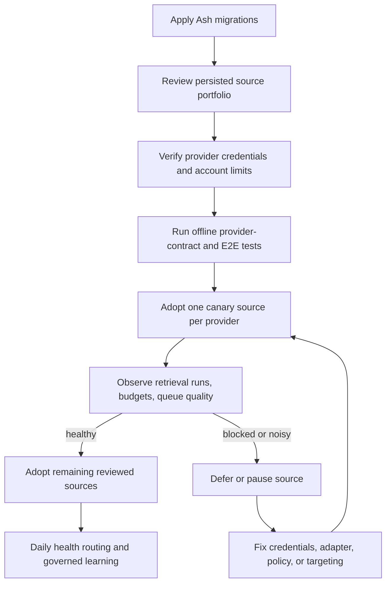

# Acquisition Autonomy Runbook

This runbook covers the governed commercial and procurement discovery paths.
The objective is autonomous retrieval with bounded spend, durable provenance,
operator review, and reversible rollout—not unattended promotion or external
side effects.

## Build and Rollout DAG

## Deployment

1. Pull the reviewed release and run `mix ash.migrate`.
2. Restart the application and confirm Oban queues `commercial_discovery`,
   `procurement_configuring`, and `procurement_scanning` are healthy.
3. Confirm the five-minute provider-reservation reaper and SLO evaluator, the
   daily discovery-learning worker, and the daily source-portfolio worker are
   present in Oban Cron.
4. Open `/acquisition/sources` and review each persisted source. Schema
   migrations intentionally leave existing rows deferred.
5. Record portfolio/compliance decisions through
   `Procurement.review_procurement_source_portfolio/3`; do not edit database
   rows directly or add source catalogs to code/configuration.

## Provider Readiness

### Exa

- `EXA_API_KEY` is sourced through the runtime environment contract. Never put
  it in a discovery program, source metadata, fixture, or task.
- Verify the Search and Contents budget windows before enabling scheduled
  commercial discovery.
- Rotation: replace the runtime secret, restart workers, run one bounded manual
  preview, then re-enable scheduled program sources.
- Emergency disable: pause active Exa `ProgramSource` records before removing
  or rotating the key.

### SAM.gov

- Verify the personal API key through the source credential flow.
- Record the account-specific daily request limit on the source. Do not use the
  API's 1,000-record page maximum as a daily quota.
- A 429 or exhausted local window must set `deferred_until`; repeated manual
  retries are an incident, not a recovery strategy.

### OpenGov

- Configure `projects_api_url` only with documented, authorized access.
- Otherwise allow only reviewed public HTTP/browser paths.
- Treat WAF challenges and schema drift as operator work. Never add evasion or
  infer a hidden endpoint from portal HTML.

### BidNet and Credentialed Portals

- Require an explicit source credential and valid encrypted browser session.
- Rotation/disable/compromise actions invalidate stored sessions.
- Keep broad BidNet automation deferred until provider terms and an automation
  contract are reviewed.

## Canary Checks

For one source per adopted provider, verify:

- one `SourceRetrievalRun` records every attempted path and terminal outcome;
- provider reservations settle/release exactly once and remaining/reset values
  appear on the source workspace;
- duplicate scans reuse the same Bid/Finding identities;
- discovered candidates enter the review queue only—no automatic Signal,
  Organization, Pursuit, or promotion side effect;
- telemetry contains bounded source type/path/outcome/reason tags and no URL,
  source ID, credential, query, or provider response as a metric label;
- zero-yield and failure streaks produce visible cadence/pause/routing actions.

## Failure Recovery

| Failure | Expected behavior | Operator action |
| --- | --- | --- |
| Provider 429/quota exhausted | Durable deferral to reset | Verify reviewed quota; wait for reset |
| Authentication/credential block | Health action routes credential attention | Rotate/test credential; clear deferral or re-enable source |
| WAF/robots/terms block | Retrieval stops with typed evidence | Defer source; review provider policy |
| Schema/selector drift | Fallback if allowed, otherwise configuration attention | Update provider adapter/fixture, then canary |
| Three terminal failures | Source pauses, history retained | Fix root cause and explicitly re-enable |
| Three zero-yield runs | Cadence slows | Review targeting/coverage before restoring cadence |
| Transaction/worker crash | Oban retry plus idempotent provider/bid/finding keys | Inspect run ledger before manual retry |

## Rollback

Rollback is data-first and does not delete history:

1. Set affected sources to `portfolio_decision: :defer` or pause them through
   the Ash domain action.
2. Pause affected commercial `ProgramSource` records.
3. Drain or cancel queued provider jobs only after checking whether a provider
   reservation is already settled.
4. Revert application code if needed. Keep applied migration files and durable
   run/reservation/finding evidence.
5. Restore one canary only after offline fixtures and the focused E2E pass.

Never rollback by deleting provider budgets, reservations, retrieval runs,
preview runs, bids, findings, or review decisions.
