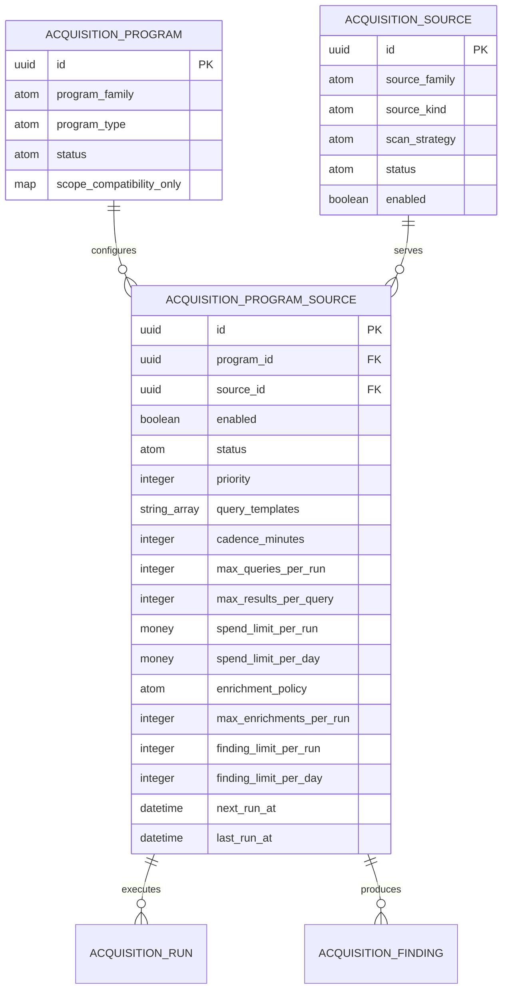
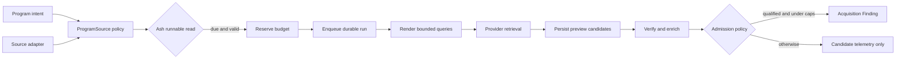

# Acquisition Program–Source Contract

Status: reviewed implementation design; schema work belongs to `gnome_ga-fx2.20`.

## Decision

The acquisition execution model has three distinct responsibilities:

- `GnomeGarden.Acquisition.Program` describes **why and what** Garden seeks.
- `GnomeGarden.Acquisition.Source` describes **where and how** Garden retrieves it.
- New `GnomeGarden.Acquisition.ProgramSource` describes **whether and under
  which bounded policy** a particular program may execute against a source.

Durable execution policy must not remain in `Program.scope`, `Program.metadata`,
`Source.metadata`, or `Commercial.DiscoveryProgram.metadata`. Metadata remains
appropriate for non-authoritative diagnostics and compatibility snapshots only.

`AcquisitionRun` is shown as the durable execution relationship but is owned by
`gnome_ga-fx2.7`. Budget reservation and consumption records are owned by
`gnome_ga-fx2.21`.

## Resource Contract

Create `GnomeGarden.Acquisition.ProgramSource` as an Ash Postgres resource in
the `GnomeGarden.Acquisition` domain.

### Relationships

- Required `belongs_to :program, GnomeGarden.Acquisition.Program`.
- Required `belongs_to :source, GnomeGarden.Acquisition.Source`.
- `Program` and `Source` each expose `has_many :program_sources`.
- `Program` and `Source` may expose read-only `through` relationships to one
  another when useful. The writable relationship remains the join resource.
- Add nullable `program_source_id` provenance to `Finding` during migration.
  Keep existing `program_id` and `source_id` for compatibility and efficient
  queue filtering; all three IDs must agree when the join is present.

### Attributes

| Attribute | Type | Rule |
| --- | --- | --- |
| `enabled` | boolean | Defaults false; activation is explicit. |
| `status` | atom | `draft`, `active`, `paused`, `blocked`, or `archived`. |
| `priority` | integer | Bounded scheduling priority; defaults to zero. |
| `query_templates` | array of strings | Provider-ready templates; no credentials or executable code. |
| `cadence_minutes` | integer | Positive and independent for every program/source pair. |
| `max_queries_per_run` | integer | Positive hard ceiling. |
| `max_results_per_query` | integer | Positive hard ceiling. |
| `spend_limit_per_run` | money | Positive USD policy ceiling, not consumption state. |
| `spend_limit_per_day` | money | Positive USD policy ceiling, enforced by budget reservations. |
| `enrichment_policy` | atom | `none`, `verify_promotable`, or `verify_ranked`. |
| `max_enrichments_per_run` | integer | Non-negative hard ceiling. |
| `finding_limit_per_run` | integer | Non-negative admission cap. |
| `finding_limit_per_day` | integer | Non-negative admission cap. |
| `next_run_at` | UTC datetime | Scheduler-owned eligibility time. |
| `last_run_at` | UTC datetime | Updated only after durable execution starts. |

Do not add a generic provider-options map in the first migration. Add a typed
attribute or embedded type when a provider requires durable configuration that
cannot be represented by these fields. Source adapter diagnostics remain on
run records, not on the policy resource.

Use one identity on `[:program_id, :source_id]`. Execution snapshots the policy
and a stable policy hash onto its run, so editing the current configuration
does not rewrite history.

## Ash Actions And Interfaces

Actions belong on `ProgramSource`; callers do not assemble runnable queries.

| Ash action | Domain interface | Purpose |
| --- | --- | --- |
| `create :create` | `create_program_source` | Create a disabled draft configuration. |
| `update :update_policy` | `update_program_source_policy` | Change bounded query, cadence, budget, enrichment, and admission policy. |
| `update :activate` | `activate_program_source` | Validate program/source state and make the pair runnable. |
| `update :pause` | `pause_program_source` | Stop scheduling while preserving history. |
| `update :block` | `block_program_source` | Record an operator-visible blocking reason. |
| `update :archive` | `archive_program_source` | Permanently remove the pair from rotation. |
| `update :mark_scheduled` | `mark_program_source_scheduled` | Advance `next_run_at` atomically after enqueue. |
| `read :for_program` | `list_program_sources_for_program` | Load program execution coverage. |
| `read :for_source` | `list_program_sources_for_source` | Load source demand and policy. |
| `read :runnable` | `list_runnable_program_sources` | Return only due, active, enabled pairs with runnable parents. |
| `read :workspace` | `get_program_source_workspace` | Stable operator detail shape with parents and recent run health. |

`activate` must reject empty query templates for query-driven providers, absent
or zero ceilings, inactive programs, disabled/blocked sources, and unsupported
source/adapter combinations. These are Ash validations/changes, not scheduler
conditionals.

`runnable` owns filtering, sorting, and required loads. Oban workers and
LiveViews call the interface and do not build `Ash.Query` directly.

## Execution Invariants

1. A program cannot execute a source without an active `ProgramSource`.
2. Parent state is authoritative: paused/archived programs and disabled,
   paused, blocked, or archived sources are never runnable.
3. Scheduling reserves budget before issuing provider requests.
4. Scheduled Exa search writes preview run/candidate telemetry only.
5. Candidate-to-Finding admission occurs only through the bounded policy owned
   by `gnome_ga-fx2.8`.
6. Runs snapshot the policy, adapter version, query set, actor, and capability
   manifest needed for audit and retry.
7. Retries reuse the original run/idempotency key and budget reservation.
8. Credentials are referenced by the source adapter and never stored in query
   templates, policy fields, run arguments, or diagnostics.

## Existing Model Compatibility

`Commercial.DiscoveryProgram` remains the commercial-facing definition during
this epic. Its existing sync change continues projecting it one-to-one into
`Acquisition.Program`. Execution reads the acquisition program and its
`ProgramSource` rows; it does not read commercial fields or metadata directly.

For the first live commercial slice, create one acquisition source representing
the Exa Search capability. Discovery programs link to that source through
`ProgramSource`. A discovered website is evidence/candidate data, not a new
execution source.

Procurement sources continue projecting one-to-one into `Acquisition.Source`.
Provider family, URL, credential requirements, and retrieval strategy belong to
the source. Program-specific terms, cadence, spend, enrichment, and admission
limits belong to `ProgramSource`.

## Migration And Backfill Plan

`gnome_ga-fx2.20` implements this plan through `mix ash.codegen` and
`mix ash.migrate`:

1. Add `ProgramSource`, relationships, identity, actions, and code interfaces.
2. Add nullable `program_source_id` to `Finding` with a Postgres reference.
3. Create the single Exa Search acquisition source idempotently.
4. Create disabled draft Exa links for existing discovery programs using their
   explicit industries, regions, search terms, cadence, and conservative
   current preview ceilings.
5. Backfill exact program/source pairs from findings that already contain both
   IDs, then attach `program_source_id` to those findings.
6. Do not guess ambiguous procurement coverage. Emit unresolved rows for
   operator review and let `gnome_ga-fx2.14` govern portfolio adoption.
7. Existing legacy scope remains readable for historical context, but execution
   requires an active typed `ProgramSource` and never falls back to legacy fields.
8. Verify row counts, uniqueness, parent consistency, enabled-state safety, and
   zero newly runnable configurations before enabling the scheduler.
9. Remove compatibility reads and obsolete metadata keys only in
   `gnome_ga-fx2.35` after the measured pilot.

Rollback disables all `ProgramSource` rows first, clears nullable provenance
references, and then removes the new table. No backfill step may activate
execution.

## Downstream Ownership

- `fx2.6`: execute Exa preview search from this contract without Findings.
- `fx2.19`: move source/program UI query shapes into Ash reads/workspaces.
- `fx2.20`: resource, migration, backfill, and compatibility implementation.
- `fx2.21`: reservations, actual cost, daily reset, and concurrency safety.
- `fx2.24`: provider fixture contract consumed by source adapters.
- `fx2.32`: provider terms, rate, retention, and allowed-automation policy.
- `fx2.35`: remove compatibility metadata and legacy execution paths.
