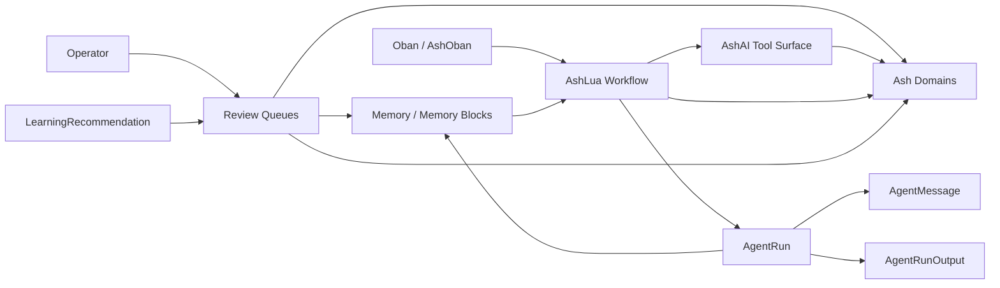

# AshLua Agent Operating System Plan

Date: 2026-06-02
Status: Planning document, not implemented model

## Purpose

This document captures the long-term plan for building GnomeGarden's agentic
runtime around Ash, AshLua, AshAI, AshOban, and the existing durable company
resources.

The goal is not to adopt another generic agent framework. The goal is to make
the company model executable, inspectable, governed, and useful to a small team
running a broad operation.

## Core Thesis

Ash is the company operating model.

AshLua is the bounded workflow language for composing Ash actions.

AshAI is the LLM tool surface, built from selected Ash actions.

Oban and AshOban are the scheduler and job execution layer.

Agent resources provide durable history, memory, workflow state, audit, and
operator review.

This means agents should not become an alternate source of truth. They should
read, propose, coordinate, and execute through Ash actions that already carry
business meaning, policies, validations, state transitions, and audit history.

## Why This Direction

Jido is extensive and useful as inspiration, but it pushes toward a broad
runtime framework. For this application, that makes the boundary harder to see.
The repo also now has a clear rule: do not add a Jido agent runtime. Keep
`jido_browser` only as browser automation behind `GnomeGarden.Browser`.

Letta is a useful memory reference. Its strongest idea is a memory hierarchy:
always-visible memory blocks, searchable long-term archival memory, and
historical conversation recall. We can implement those concepts as Ash
resources without adopting Letta as the runtime.

AshAgent is useful as Ash-specific inspiration. The valuable parts are
declarative agent definitions, schemas, context-oriented conversations, provider
abstraction, telemetry, and resource-oriented execution. We should not copy a
general runtime wholesale.

## Architecture Principles

- Business state lives in business domains.
- Runtime state lives in `GnomeGarden.Agents`.
- Agent workflows call Ash actions; they do not bypass policies with raw data
  access.
- Lua coordinates and branches; Ash owns the meaning of each business action.
- LLM tool access is narrow and workflow-specific, not a broad catalog of every
  action in every domain.
- Memory changes are proposed, reviewed, versioned, and attributable.
- Learning is a governed loop, not silent self-modification.
- Long-running work is scheduled and observed through Oban and AshOban.
- Operators need consoles for stuck jobs, failed runs, pending learning,
  memory review, workflow versions, and credential blockers.

## Current Repo Boundary

Current durable runtime resources already include:

- `Agent`
- `AgentDeployment`
- `AgentRun`
- `AgentMessage`
- `AgentRunOutput`
- `Memory`

Current relevant company resources include:

- `CompanyProfile`
- `CompanyProfileLearning`
- procurement source pipeline resources
- acquisition sources, programs, findings, and signals
- commercial discovery resources

The plan below extends this existing model instead of replacing it.

## Proposed Runtime Model



## Memory Model

The memory model should copy the useful shape from Letta while keeping Ash as
the persistence and policy layer.

### Core Memory Blocks

Add an app-wide `GnomeGarden.Operations.MemoryBlock` resource for
always-visible structured memory.

This is for information that should be injected into the agent context before a
workflow or conversation starts, and for company knowledge that other domains
can also use.

Candidate fields:

- `id`
- `label`
- `description`
- `value`
- `limit`
- `read_only?`
- `scope`
- `owner_type`
- `owner_id`
- `status`
- `version`
- `metadata`
- `source`
- `created_by_id`
- `approved_by_id`
- `inserted_at`
- `updated_at`

Useful block examples:

- `company_profile`
- `sales_voice`
- `procurement_strategy`
- `operator_preferences`
- `source_scanning_rules`
- `current_market_notes`
- `do_not_do`

Read-only memory blocks should hold policy, compliance, strategy, and durable
company guidance. Writable or proposed blocks can hold evolving summaries and
working context.

### Archival Memory

Upgrade the existing `Memory` resource into long-term searchable memory.

This is for facts, observations, documents, historical notes, and useful
snippets that do not always belong in the LLM context window.

Candidate fields to add or confirm:

- `content`
- `namespace`
- `tags`
- `source`
- `source_record_type`
- `source_record_id`
- `confidence`
- `review_status`
- `expires_at`
- `last_used_at`
- `usage_count`
- `embedding`
- `metadata`

Recommended actions:

- `propose_memory`
- `approve_memory`
- `reject_memory`
- `expire_memory`
- `recall_for_scope`
- `search_by_tags`
- `search_semantic`
- `mark_used`

The key design rule: agents can propose memory, but important memory should not
silently become active business guidance without review or policy approval.

### Conversation Recall

Keep `AgentMessage` as historical recall.

This should be separate from curated memory. Conversation recall answers,
"what happened before?" Archival memory answers, "what did we decide was worth
remembering?"

## Learning Model

Add a `LearningRecommendation` resource.

This is the bridge between agent observations and company behavior changes. It
prevents the system from silently rewriting strategy, filters, policies,
prompts, or scoring logic.

Candidate fields:

- `id`
- `target_type`
- `target_id`
- `target_action`
- `proposed_change`
- `evidence`
- `impact_summary`
- `risk_level`
- `confidence`
- `status`
- `reviewer_id`
- `reviewed_at`
- `applied_at`
- `source_agent_run_id`
- `metadata`

Candidate statuses:

- `proposed`
- `needs_review`
- `approved`
- `rejected`
- `applied`
- `expired`

Examples:

- "PlanetBids scans fail without credentials; mark source as credential-blocked."
- "This district repeatedly publishes relevant water infrastructure bids; raise source priority."
- "This phrase indicates maintenance work, not acquisition fit; lower finding confidence."
- "Operator rejected these ten findings for the same reason; propose an intake rule update."

## Workflow Model

Add an `AgentWorkflowDefinition` resource for versioned AshLua workflows.

Candidate fields:

- `id`
- `key`
- `name`
- `description`
- `version`
- `lua_source`
- `input_schema`
- `output_schema`
- `allowed_domains`
- `allowed_actions`
- `allowed_tools`
- `risk_level`
- `enabled?`
- `published_at`
- `created_by_id`
- `approved_by_id`
- `metadata`

Recommended actions:

- `draft`
- `validate`
- `publish`
- `disable`
- `run`
- `clone_version`

The workflow runner should:

1. Load the workflow definition.
2. Validate input against the workflow schema.
3. Build an AshLua VM with actor, tenant, and context.
4. Expose only approved Ash actions and AshAI tools.
5. Persist `AgentRun`, `AgentMessage`, and `AgentRunOutput`.
6. Capture failures with structured metadata.
7. Emit learning and memory proposals instead of applying risky changes
   directly.

## Tool Surface Model

AshAI tools should be built around narrow workflow needs.

Avoid giving an agent every action in every domain. Instead, define toolsets:

- procurement source inspection
- acquisition finding review support
- commercial qualification
- billing exception triage
- maintenance planning support
- operator reporting

Each toolset should have:

- allowed domains
- allowed actions
- required actor/role
- input schema
- output schema
- rate/usage limits where needed
- audit metadata

## Oban and Health Model

Oban remains the job execution layer.

Stuck job handling should be explicit:

- Lifeline rescues stale `executing` jobs after the configured threshold.
- Health checks flag stale executing jobs before they quietly become invisible.
- Operators can inspect, cancel, retry, or drain jobs through the Oban dashboard
  and future internal operator screens.

Recommended agent health dimensions:

- stale executing jobs
- failed runs by worker/template
- credential blockers
- repeated source failures
- memory proposals waiting for review
- learning recommendations waiting for review
- workflow versions disabled by failure
- tool-call failures by domain/action
- provider/API configuration presence, without exposing secret values

## Operator Console Model

The operator console should expose the parts that matter to a small team:

- active runs
- failed runs
- stuck or stale jobs
- pending learning recommendations
- pending memory proposals
- workflow definitions and versions
- source credential blockers
- scan failure clusters
- tool/action audit trail

The console should make it easy to answer:

- What is running?
- What is stuck?
- What failed repeatedly?
- What did the agent learn?
- What does it want to change?
- What needs a human decision?

## Evaluation Model

Add an evaluation harness before allowing broad autonomous behavior.

Candidate resources:

- `AgentEvalCase`
- `AgentEvalRun`

`AgentEvalCase` should store:

- workflow key/version
- frozen input
- expected output
- expected actions
- forbidden actions
- expected memory proposals
- expected learning recommendations
- human label

`AgentEvalRun` should store:

- eval case
- agent run
- pass/fail result
- action trace
- tool trace
- output diff
- reviewer notes

This gives the team a way to improve prompts, memory, Lua workflows, and tool
surfaces without relying on vibes.

## Rollout Plan

### Phase 1: Stabilize The Runtime Substrate

- Keep the current no-Jido-runtime boundary.
- Keep direct workers and AshOban actions as the production execution path.
- Add explicit health around stale jobs, failed runs, and provider readiness.
- Add runtime metadata to runs where needed.

### Phase 2: Governed Memory

- Add `GnomeGarden.Operations.MemoryBlock` as the first app-wide governed memory
  resource.
- Upgrade `Memory` with review state, source, confidence, expiry, tags, and
  usage tracking, or replace agent-only memory with an app-wide archival memory
  resource after the first memory block slice is stable.
- Add memory proposal and approval actions.
- Add operator review UI for memory proposals.

### Phase 3: Learning Recommendations

- Add `LearningRecommendation`.
- Connect operator feedback to learning recommendations.
- Allow approved recommendations to update company profile, source settings,
  filters, or workflow configuration through Ash actions.

### Phase 4: Versioned AshLua Workflows

- Add `AgentWorkflowDefinition`.
- Move procurement/source scanning Lua into versioned workflow definitions or
  workflow modules with the same shape.
- Restrict each workflow to a narrow tool/action set.
- Persist run input, output, failure, and learning proposals.

### Phase 5: Narrow AshAI Toolsets

- Define toolsets by workflow.
- Use AshAI to expose only allowed Ash actions.
- Add audit fields for every tool call.
- Add tests for forbidden tool/action attempts.

### Phase 6: Operator Console

- Build review surfaces for memory and learning.
- Add failed-run and stuck-job visibility.
- Add workflow version and tool audit views.
- Surface source credential blockers and repeated failure clusters.

### Phase 7: Evaluation Harness

- Add eval case and eval run resources.
- Create frozen test cases for procurement scanning, acquisition finding review,
  and commercial qualification.
- Track output quality, action correctness, and memory quality over time.

## First Implementation Slice

The highest-leverage first slice is:

1. Add `GnomeGarden.Operations.MemoryBlock`.
2. Add app-wide archival memory or migrate agent-only `Memory` behind the new
   app-wide memory actions.
3. Add `LearningRecommendation`.
4. Add a small review UI for pending memory and learning changes.
5. Add one versioned AshLua workflow for procurement source inspection.

This creates the durable loop:

```text
run -> observe -> propose memory/learning -> operator review -> approved Ash change
```

That loop is more important than adding more agent autonomy.

## What To Borrow

### From Letta

Borrow:

- memory blocks
- archival memory
- conversation recall separation
- shared/read-only memory blocks
- memory as a visible operator surface

Do not borrow:

- the runtime as the company execution boundary
- autonomous memory mutation without Ash policies and review

### From AshAgent

Borrow:

- declarative agent/workflow definitions
- schema-oriented inputs and outputs
- context-based conversations
- call/stream action shape
- telemetry and provider abstraction ideas

Do not borrow:

- a generic runtime that obscures Ash policy boundaries
- broad all-domain tool catalogs
- unreviewed self-modification

### From Jido

Borrow:

- runtime design vocabulary
- process and action decomposition ideas
- browser automation lessons already isolated behind `GnomeGarden.Browser`

Do not borrow:

- a new Jido production agent runtime
- Jido-owned business state

## Open Questions

- Should `GnomeGarden.Operations.MemoryBlock` eventually move to a dedicated
  `GnomeGarden.Knowledge` domain after the model proves itself?
- Should memory approval be role-based only, or should high-risk memory require
  a second approval?
- Which workflows are allowed to write business records without human review?
- Which workflows can only propose changes?
- Should semantic search use a dedicated vector extension now, or start with
  tags and full-text search until the memory corpus is larger?
- How much of `CompanyProfileLearning` should be merged into the broader
  `LearningRecommendation` model?

## References

- AshAI tools: https://hexdocs.pm/ash_ai/AshAi.Tools.html
- AshLua package: https://hex.pm/packages/ash_lua
- AshAgent inspiration: https://github.com/bradleygolden/ash_agent
- Letta repo: https://github.com/letta-ai/letta
- Letta memory overview: https://docs.letta.com/guides/agents/memory
- Letta memory blocks: https://docs.letta.com/guides/agents/memory-blocks/
- Letta archival memory: https://docs.letta.com/guides/core-concepts/memory/archival-memory/
