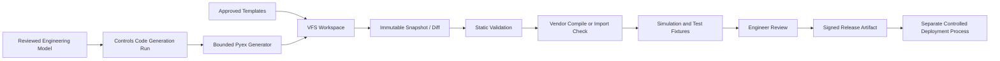

# Code-Mode Workflow Runtime Notes

Date: 2026-07-11
Status: Implementation guidance, not implemented model

## Purpose

This document records how GnomeGarden could evaluate code-mode agent workflows
using the Elixir `pyex`, `just_bash`, `vfs`, and `exgit` packages without
weakening the existing Ash, AshLua, AshAI, Oban, and agent-control-plane
boundaries.

The central idea is useful: give a model a bounded execution environment with
explicitly injected capabilities, then let deterministic code own loops,
branching, retries, ranking, and data transformation. LLM calls and real-world
effects stay at narrow leaves.

The decision is not to replace AshLua or adopt the entire package stack at
once. The first step should be a read-only Pyex evaluation behind the existing
workflow governance and eval system.

The longer-term high-value use case may be production controls-code generation:
building a reviewable PLC project from governed specifications, templates, and
capabilities inside a VFS workspace. In that use case, "production code" means
an artifact that can pass engineering validation and release gates. It does not
mean generated code may connect to or download directly into a controller.

## Executive Decision

- Keep Ash as the business boundary and source of truth.
- Keep AshLua as the preferred runtime for compact, write-oriented workflows
  that benefit from AshLua transaction behavior.
- Evaluate Pyex as an additional runtime for read-heavy analysis, ranking,
  transformation, and substantial artifact generation such as controls-code
  packages.
- Reuse `AgentWorkflowDefinition`, `AgentRun`, `AgentMessage`,
  `AgentRunOutput`, and the existing eval lifecycle instead of creating a
  parallel agent platform.
- Reuse `WorkflowToolset` as the authorization and audit boundary for injected
  capabilities.
- Execute untrusted programs in separately monitored, heap-capped BEAM
  processes. Interpreter-level limits alone are not sufficient.
- Persist reconstructable workflow data and snapshots, not live interpreter
  contexts or captured capability functions.
- Defer JustBash, Exgit, and service-mode programs until a Pyex pipeline pilot
  demonstrates a concrete benefit.

Pyex should run beside AshLua, not inside the Lua VM. An AshLua workflow may
call an intent-named Ash action such as `generate_controls_code_package`; that
action may enqueue a bounded Pyex worker. The language runtimes should not
directly embed or invoke one another.

## Why It Fits The Current Garden

GnomeGarden already implements most of the control plane that code-mode
workflows require:

- versioned workflow definitions
- input and output schemas
- explicit allowed domains, actions, and tools
- draft, validation, publication, disable, and archive states
- durable run records and run outputs
- tool-call and tool-result audit messages
- workflow-specific eval cases and eval runs
- actor-aware Ash action dispatch
- operator review surfaces

The missing piece is not another agent platform. It is a runtime adapter that
can execute a governed program against the same capability manifest.

## Upstream Maturity Notes

The package family is promising but should be treated as experimental:

- Pyex is pre-1.0 and explicitly states that it has not received a third-party
  security audit.
- Pyex's published Hex release may lag substantial work on its main branch
  while retaining the same package version.
- JustBash custom commands are trusted host code and are outside the shell's
  filesystem and network sandbox.
- VFS is pre-1.0 and its persistence characteristics depend on the selected
  mount backend.
- Exgit is pre-1.0 and does not claim production hardening.

For a pilot, pin reviewed commits or an explicitly reviewed release. Do not
silently track a moving branch in production. Record the package version,
source commit, and workflow source hash on each run.

Upstream references:

- <https://github.com/ivarvong/pyex>
- <https://github.com/elixir-ai-tools/just_bash>
- <https://github.com/ivarvong/vfs>
- <https://github.com/ivarvong/exgit>

## Proposed Runtime Boundary

Add a small runtime behavior rather than branching on language throughout the
application.

Conceptual contract:

```elixir
@callback validate(definition, opts) :: {:ok, validation} | {:error, term}
@callback execute(definition, input, context, opts) ::
            {:ok, result, execution_metadata} | {:error, term, execution_metadata}
```

Candidate adapters:

- `GnomeGarden.Agents.WorkflowRuntimes.AshLua`
- `GnomeGarden.Agents.WorkflowRuntimes.Pyex`

The adapter owns language-specific compilation, execution, normalization, and
runtime metadata. It does not own business authorization, persistence, or
workflow lifecycle transitions.

Do not expose Pyex, JustBash, or VFS directly from LiveViews, controllers, or
business-domain callers.

For composed workflows, use Ash actions as the boundary:

```text
AshLua workflow
  -> intent-named Ash action
  -> durable generation run
  -> bounded Pyex worker
  -> generated artifact and validation results
  -> Ash state transition
```

This keeps AshLua optional. The same generation action can be launched from an
operator screen, an Oban schedule, or a plain Elixir workflow without requiring
a Lua wrapper.

## Workflow Definition Evolution

`AgentWorkflowDefinition` currently has a Lua-specific `lua_source` field. A
production implementation should evolve toward runtime-neutral fields such as:

- `runtime`: `:ash_lua` or `:pyex`
- `source`: program source
- `source_sha256`: immutable source digest
- `runtime_options`: bounded, validated runtime configuration
- `capability_manifest_version`: identifies the host capability contract

Do not overload `lua_source` with Python during the pilot. If persistence is
required for the pilot, add the runtime-neutral shape through the Ash migration
workflow and preserve compatibility for existing Lua definitions.

Validation should verify:

- the runtime is supported
- source compiles
- input and output schemas are valid
- requested actions and tools exist in the capability registry
- runtime limits are within server-controlled ceilings
- published definitions reference a reviewed runtime dependency version

## Capability Injection

Pyex imports and JustBash custom commands are only ergonomic frontends. The
actual authority must remain in trusted Elixir adapters.

The host should construct capabilities from:

- the persisted workflow allowlist
- the current actor
- the current `AgentRun`
- workflow risk level
- deployment configuration
- server-owned resource limits

Each injected function should delegate to `WorkflowToolset` or to an equivalent
workflow-specific registry that:

- checks the action is present in the workflow allowlist
- validates and normalizes arguments
- calls an intent-named Ash domain interface
- passes the bound actor
- records a tool-call message before execution
- records a tool-result message after execution
- returns a serialization-safe result

The program must not be allowed to provide or replace its actor, domain module,
action module, repository, HTTP client, browser implementation, or credentials.

Prefer capability names based on business intent, for example:

```python
from procurement import list_ranking_candidates
from procurement import describe_source
from outputs import emit_ranking
```

Avoid broad capabilities such as arbitrary SQL, arbitrary Ash action dispatch,
unrestricted HTTP, raw browser commands, filesystem access, or module names
supplied by the program.

## Process Isolation

Pyex executes synchronously in its caller. Cooperative interpreter limits must
be backed by a separate process owned by GnomeGarden.

The Pyex runtime should:

1. Start execution under a dedicated `Task.Supervisor` using an unlinked task
   or monitored process.
2. Set `Process.flag(:max_heap_size, ...)` inside the child process.
3. Include shared binaries in heap accounting on supported OTP versions.
4. Configure Pyex step, memory-estimate, output, and cooperative timeout limits.
5. Set a hard wall timeout slightly above the cooperative timeout.
6. Brutally kill the child when the hard timeout expires.
7. Normalize timeout, out-of-memory, syntax, runtime, capability, and host
   failures into `RunFailure` details.
8. Return only normalized outputs and execution metadata across the process
   boundary.

The current direct runtime path uses `Task.start/1` and does not add a per-run
heap ceiling. Do not execute Pyex through that path without adding the hard
process boundary.

## Durability And Oban

Oban does not automatically make an interpreter value durable. Oban arguments
must identify reconstructable state.

Persist:

- workflow definition ID and version
- source hash
- runtime and runtime dependency version
- normalized input
- actor or requesting team-member identity needed to reconstruct authorization
- capability manifest version
- VFS snapshot or durable artifact references when required
- completed step or checkpoint identifier when the workflow supports resume
- output and execution metadata

Reconstruct on every attempt:

- actor
- Ash domain capability functions
- HTTP or browser clients
- credentials
- telemetry handlers
- interpreter context

Do not persist anonymous functions, PIDs, monitors, open connections, task
references, or a raw interpreter context as an Oban argument.

The durable execution path should be an Oban worker keyed by `AgentRun`. It
should be idempotent, detect already completed runs, and safely recover runs
left in `:running` after a node crash.

## Effects And Transactions

Value semantics stop at an injected effect. A forked VFS or interpreter state
does not fork database writes, browser sessions, S3 writes, emails, or remote
API calls.

Use one of these patterns in preference order:

1. **Pure proposal:** the program reads frozen inputs and returns an intent;
   one Ash action validates and commits it.
2. **Single transactional action:** one injected capability calls an
   intent-named Ash action that owns all required writes.
3. **Idempotent leaf actions:** multiple injected effects carry stable
   idempotency keys derived from run ID and logical step ID.
4. **Explicit checkpointing:** only when a long-running workflow cannot be
   expressed using the first three patterns.

Do not assume an arbitrary sequence of injected Ash actions shares an AshLua
transaction. Keep AshLua for workflows where its transaction boundary is the
main requirement.

## VFS And Artifacts

Use `VFS.Memory` for the first pilot. Treat it as scratch state, not durable
company storage.

If durable artifacts become necessary:

- persist outputs through domain-owned AshStorage resources
- store artifact references on `AgentRunOutput`
- store a bounded VFS snapshot only when it has clear replay value
- enforce per-run file count and byte limits
- reject path traversal and unsupported mount operations
- keep credentials and secrets out of snapshots

A future Ash-backed VFS mount should expose a narrow document or dataset view,
not a generic database filesystem.

## JustBash Position

JustBash may later provide a useful Unix-style composition interface over the
same capability registry. It should not introduce a second authority model.

Potential later use:

```bash
procurement candidates --source "$SOURCE_ID" |
  jq '[.[] | select(.eligible)]' |
  rank-candidates
```

Every custom command must still call the same actor-bound Ash interfaces and
produce the same audit events as a Pyex capability.

Do not add JustBash during the first Pyex pilot. Running two experimental
language surfaces at once would make evaluation results harder to interpret.

## Exgit Position

Do not use Exgit as the initial workflow store. GnomeGarden already has
database-backed workflow versions, lifecycle states, schemas, eval cases, and
operator governance.

Exgit becomes relevant only if the product needs:

- agent work over a remote source repository
- reviewable multi-file patches
- cheap branchable repository snapshots
- git-native workflow exchange with external systems

It should not become an alternate source of truth for published Garden
workflow definitions without a separate architecture decision.

## PLC And Controls-Code Generation

Controls-code generation is a stronger long-term fit for the full value-based
stack than the initial ranking pilot. It benefits from a multi-file workspace,
deterministic programmatic generation, cheap snapshots, diffs, fixtures, and
repeatable validation.

### Runtime Responsibilities

Use the layers this way:

- **Ash** owns project identity, customer/site isolation, engineering inputs,
  approval state, artifact provenance, release state, and authorization.
- **AshLua** may coordinate business workflow decisions and release gates, but
  does not need to generate source files.
- **Pyex** runs the generator program that transforms normalized engineering
  inputs into source, configuration, documentation, and test artifacts.
- **VFS** provides the isolated generation workspace and captures the exact
  files produced by a run.
- **JustBash** may later provide deterministic text-processing and packaging
  commands over that VFS.
- **Exgit** may snapshot and diff a generated controls-code workspace when a
  git-shaped project representation provides real review value.
- **Oban** runs generation and validation attempts durably.

### Candidate Inputs

The generator should consume normalized, reviewed inputs rather than an
unbounded natural-language prompt:

- target PLC platform and approved firmware/toolchain version
- project coding standard and naming rules
- approved function-block or routine templates
- I/O list and tag definitions
- equipment modules and control narratives
- alarm and interlock matrix
- sequence/state-machine specification
- safety boundary classification
- communications map
- HMI tag contract when applicable
- customer and site-specific constraints
- prior approved project patterns

Natural-language documents may be analyzed upstream, but the final generator
input should be a schema-validated engineering model with explicit unresolved
questions.

### Candidate Outputs

Depending on the target platform, a generation package may contain:

- IEC 61131-3 Structured Text where supported
- vendor import formats or project XML
- tags, data types, routines, and function blocks
- alarm and interlock declarations
- I/O mapping tables
- simulator or test-harness fixtures
- generated test cases and expected traces
- cross-reference and dependency reports
- operator-facing sequence documentation
- a machine-readable generation manifest
- source hashes and toolchain versions

Do not claim portable PLC generation when the output is vendor-specific. The
platform adapter must make those differences explicit.

### Generation Pipeline



Pyex and JustBash cannot execute arbitrary vendor engineering binaries. A
compile, import, lint, or simulation capability must call a separately isolated
and explicitly configured build service or worker that owns the real toolchain.
The generated program receives only the validation result and produced
artifacts; it does not receive general shell access to that host.

### Mandatory Safety Gates

Generated controls code must not be considered releasable until it passes:

- schema validation of every engineering input
- source formatting and static project rules
- forbidden-instruction and forbidden-pattern checks
- complete tag, I/O, alarm, and interlock cross-reference checks
- vendor parser, importer, or compiler validation where available
- deterministic test fixtures for normal and fault paths
- simulation or emulation appropriate to the target platform
- comparison against the approved control narrative
- explicit handling of unresolved requirements
- human controls-engineer review
- versioned approval and signed release artifact creation

Safety functions, emergency stops, protective interlocks, motion limits, burner
management, process safety, and other hazard-reduction logic require stricter
domain-specific review. Generated code must never silently infer missing safety
requirements or mark them complete.

### Deployment Boundary

Code generation and controller deployment must be separate workflows.

The generation runtime must not receive:

- controller network credentials
- programming-software automation credentials
- direct plant-network access
- a capability to place a controller in program or remote mode
- a capability to download, flash, start, stop, or force I/O

Deployment should consume only an approved, immutable release artifact and
should remain an operator-controlled commissioning process with its own audit
and rollback plan.

### Data Model Pressure

The repo currently models PLC work as an execution discipline, but it does not
yet have an implemented controls-code artifact lifecycle. Before production
generation, model the durable business concepts through Ash. Likely concepts
include:

- controls-code generation run
- engineering input revision
- generated project artifact
- validation result
- review decision
- released controls-code package
- relationship to project, work item, customer, and site

Do not store these solely as agent messages, VFS values, or generic blobs.
Domain-owned document resources should hold released files, while generation
and validation records preserve provenance and lifecycle state.

### Recommended PLC Pilot

Do not begin by generating a complete live machine program. Start with a
non-deployable, fixture-backed library artifact such as:

- tag and UDT generation from a reviewed I/O schema
- an alarm declaration package and cross-reference report
- a pure sequence/state-machine module with simulator fixtures
- Structured Text for a non-safety utility function with exhaustive tests

The pilot should use approved templates, produce a deterministic VFS snapshot,
run static validation, and require engineer review. It should have no controller
connection and no production deployment capability.

## Initial Pilot

Use one fixture-backed, read-only procurement ranking workflow.

Inputs:

- a frozen list of normalized procurement candidates
- a frozen company or acquisition profile summary
- an explicit ranking rubric
- stable workflow parameters such as maximum result count

Capabilities:

- preferably none for the first fixture test
- at most one intent-named Ash read action for loading candidates in the
  integrated test
- no browser, network, database writes, storage writes, or arbitrary HTTP

Output:

- ranked candidate IDs
- score components
- concise rationale
- rejected candidate IDs with reason codes
- deterministic execution metadata

The pilot should run as an `AgentEvalCase` and produce an `AgentEvalRun`. It
should not be launched from a production deployment until it passes the go/no-go
criteria below.

## Pilot Evaluation Matrix

Compare Pyex with a deterministic Elixir or AshLua baseline.

Measure:

- output correctness against fixtures
- deterministic replay with fixed inputs and seed
- source compile and cold-start latency
- total runtime latency
- peak process memory
- hard timeout behavior
- hard heap-limit behavior
- malformed and adversarial program handling
- maximum output enforcement
- capability denial behavior
- audit completeness
- Oban retry behavior
- node-crash recovery behavior
- source and dependency version traceability

## Phased Implementation

### Phase 1: Runtime Spike

- pin a reviewed Pyex commit or release in a non-production branch
- add the runtime behavior and Pyex adapter
- add hard process ceilings
- support pure input and output only
- add unit tests for timeout, memory, syntax, and output limits

### Phase 2: Governed Eval Pilot

- add runtime-neutral workflow definition fields
- connect the adapter to the existing workflow lifecycle
- add the fixture-backed procurement ranking eval
- persist runtime metadata and source hashes
- compare against the baseline implementation

### Phase 3: Read Capability

- add one intent-named Ash read action
- expose it through `WorkflowToolset`
- bind actor and run identity at capability construction
- verify authorization and audit behavior

### Phase 4: Durable Execution

- move execution to an idempotent Oban worker
- reconstruct capabilities on each attempt
- recover abandoned running runs
- persist bounded artifacts and checkpoints when justified

### Phase 5: Shadow Production

- shadow a real workflow without committing business writes
- compare recommendations with operator or existing-system decisions
- publish only after eval and operator review thresholds are met

### Deferred

- JustBash frontend
- Exgit workspace integration
- model-generated workflow harvesting
- automatic promotion of learned programs
- long-lived Pyex service mode

## Go/No-Go Criteria

Proceed beyond the pilot only if:

- no capability can be reached outside the persisted allowlist
- actor authorization is preserved on every Ash call
- hard timeout and memory tests terminate the guest without destabilizing the
  calling process
- Oban retries do not duplicate effects or outputs
- outputs are schema-valid and fully attributable to source and runtime version
- the workflow materially improves maintainability, model-call count, latency,
  or correctness over the simpler baseline
- operators can inspect the source, inputs, capability calls, outputs, and
  failure reason from the existing agent console

Stop or defer if:

- the workflow requires broad ambient capabilities
- durable resume requires serializing live functions or process state
- equivalent AshLua or Elixir code is materially simpler
- package release drift prevents reproducible deployments
- the security boundary depends on prompt instructions rather than host
  enforcement

## Workflow Harvesting

Workflow harvesting should be a later governed feature, not part of the runtime
spike.

A harvested program is standing privilege. Promotion should require:

- normalized source
- source hash
- declared input and output schemas
- explicit capability manifest
- fixtures derived from successful and failed trajectories
- eval thresholds
- static and runtime validation
- shadow execution
- operator approval
- immutable published version
- rollback to the previous published version

The system may propose a new workflow version, but it must not silently publish
or widen its own capabilities.

## Non-Goals

- replacing Ash with an interpreter-managed data model
- exposing Repo, Ecto, arbitrary SQL, or arbitrary modules to generated code
- replacing `GnomeGarden.Browser` with raw browser operations
- treating in-process interpretation as equivalent to a container or microVM
- storing business documents only inside VFS snapshots
- using Python because it is fashionable when AshLua or Elixir is simpler
- allowing model-written code to approve or publish itself

## Expected Beadwork Shape

When implementation begins, create a multi-step epic rather than treating it
as a quick fix. Suggested children:

1. Define runtime-neutral workflow schema and adapter behavior.
2. Implement the heap-capped Pyex sandbox runner.
3. Add capability registry and actor-bound read adapter.
4. Build the fixture-backed procurement ranking eval.
5. Add Oban durability and abandoned-run recovery.
6. Run shadow evaluation and record the adoption decision.

The dependency sequence should keep capability integration behind the sandbox
runner and keep durable production execution behind the eval pilot.
