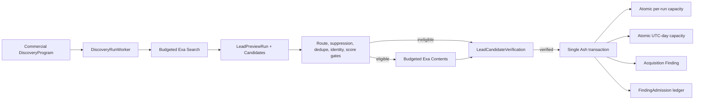

# Commercial Candidate Verification and Admission

Scheduled commercial discovery separates candidate telemetry, external verification, and
Finding admission. Search results are never promoted directly into commercial records.

## Invariants

- `LeadPreviewRun` is idempotent by the durable discovery execution key. Oban recovery reuses
  the same candidate rows and provider reservations.
- Paid Exa Contents calls use the configured `{"exa", "contents"}` provider profile and cache
  replay evidence in the reservation ledger.
- Only candidates routed `:promote` with `dedupe_context == :new`, a valid company domain,
  sufficient Exa score, and cited first-party evidence can be verified.
- Verification does not imply admission. `LeadCandidateVerification` preserves qualified,
  ineligible, and unresolved decisions even when queue capacity is unavailable.
- Finding creation, normalized-domain admission identity, and both capacity increments commit
  in one Ash transaction. A conflict rolls back every increment.
- The scheduled path creates only `Acquisition.Finding` and `FindingAdmission` records. It does
  not create Organizations, DiscoveryRecords, Signals, Pursuits, or review transitions.

## Persisted Policy

`Acquisition.LeadAdmissionPolicy` owns the operator-tunable limits in the database. The
`commercial-default` row is created idempotently on first use:

- `candidate_limit` bounds paid verification attempts per preview run.
- `finding_run_limit` caps Findings from one preview run.
- `finding_daily_limit` caps Findings across all commercial discovery runs per UTC day.
- `min_search_score` rejects weak or missing Exa search scores before enrichment spend.
- `min_evidence_characters` requires cited first-party page text in addition to structured
  company verification.

Operators update the policy through Acquisition domain actions. Changing limits affects newly
opened capacity windows; existing run and daily windows retain the limits under which they were
created.
