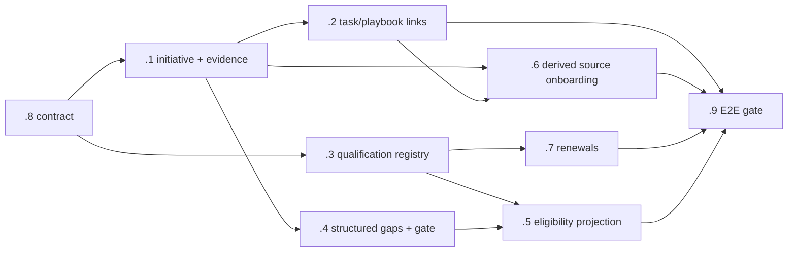

# Company Growth — Architecture Contract

Status: contract for epic `gnome_ga-gkc`. This document pins ownership
boundaries so operational state is never duplicated across Profile,
Qualification, Initiative, and Source. Every bead in the epic builds against
these rules.

## The four concepts (never merged)

| Concept | Resource | Owns | Never owns |
|---|---|---|---|
| Idea / decision | `Company.GrowthInitiative` | Intent, evaluation, decision history, outcome notes | Capability facts, execution state |
| Evidence | `Company.GrowthInitiativeEvidence` | Which bids exposed which gaps, quoted requirements, observed vs required | Anything aggregated into metadata arrays |
| Delivery | `Operations.Task` / `PlaybookRun` | The human work (via `company_growth_initiative_id`, later `company_qualification_id`) | Decision rationale |
| Capability | `Company.Qualification` | Durable capability facts: identifiers, dates, lifecycle, evidence document, owner | Company identity semantics |

Industry reference: Jira Product Discovery (ideas linked to, not stored as,
delivery issues); Salesforce (tasks are activities on business records).
Ideas are NOT tasks; an `:idea` task type was explicitly rejected.

## Ownership boundaries

1. **`Company.Profile` owns semantic company identity.** It changes only
   through operator-reviewed updates. Qualifications are never copied into
   profile arrays and never mutate the profile silently.
2. **`Company.Qualification` owns capability facts** — kind + issuing
   authority + identifier + effective/expiration + lifecycle
   (pending/active/expired/suspended/retired) + renewal lead time + owner +
   evidence `Company.Document`. Typed per-kind validation on a `details` map
   (registration, license, certification, insurance limit, bonding capacity
   with single-project AND aggregate limits, partner standing) — validated
   maps now, embedded typed resources when the vocabulary grows (same
   right-sizing call, with the same recorded upgrade path, as automation rule
   definitions). `Company.ComplianceObligation` remains scoped to recurring
   legal obligations and is not stretched.
3. **`Company.GrowthInitiative` owns intent and decisions.** Lifecycle
   `idea → evaluating → planned → in_progress → achieved | declined`, plus
   `on_hold`. Decided initiatives are never deleted — they ARE the history.
   All initiative content is database data; only the category enum lives in
   code. There is no hard-coded installer: real initiatives are entered
   through domain interfaces after deployment.
4. **`Procurement.ProcurementSource` owns its onboarding state.** The
   initiative side reads a **derived** `onboarding_state` calculation
   (approved+enabled, configured, valid credential/session when login
   required, first successful retrieval/crawl run) — no second persisted
   status. "Source activated" = first successful scan, not account creation.
5. **Evidence is rows, not metadata.** `GrowthInitiativeEvidence` links
   initiative ↔ bid/finding with gap category, quoted requirement, observed
   vs required value, confidence, and operator note. Many bids per
   initiative; many gaps per bid.

## Eligibility semantics (bead .5)

- `ProfileContext` loads ACTIVE qualifications into its immutable runtime
  snapshot alongside profile fields.
- Bid evaluation matches **explicit structured requirements** (the gap
  vocabulary from `.4`: missing certification, bond capacity, license class,
  insurance limit, tech platform — geography excluded, it is targeting
  strategy) against qualification keys.
- Missing requirements surface as eligibility risks/gaps on the bid — they
  do not blindly change scores.
- Only semantic capability changes (a genuinely new service line) go through
  an operator-reviewed profile update.

## Recommendation gate (bead .4)

`Operations.LearningRecommendation` is the only path from agent-observed
evidence to an initiative. A high-level workflow module (the
`Acquisition.Review` pattern) transactionally: approves the recommendation →
creates or reuses the GrowthInitiative → links all supporting evidence →
marks the recommendation applied. No generic dispatcher executing
target-action strings. Agents never create or start initiatives directly.
Gap evidence carries a repeat threshold, time window, and dedupe identity.

## Renewal automation (bead .7)

Dynamic episodes derived from each qualification's `renewal_lead_time`
(30–90 days typical), dedupe-keyed by qualification + expiration date +
threshold, emitted into the existing automation evaluator. Renewal work is
filed to the qualification's owner and linked via `company_qualification_id`.

## Build order

