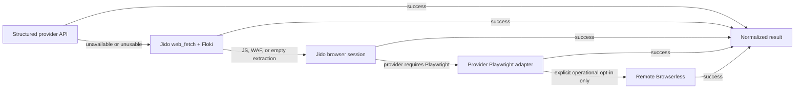

# Staged Retrieval Policy

Procurement and company-source scans choose retrieval backends through
`GnomeGarden.Procurement.RetrievalPolicy`. Provider adapters supply explicit stage functions;
the policy owns ordering, fallback, normalized results, and durable evidence.

The diagram describes priority, not a requirement to attempt every stage. A source receives only
the stages supported by its provider. Public PlanetBids uses provider API then browser; generic
server-rendered sources use HTTP then browser; OpenGov uses only its persisted allowed paths and
never guesses a private API endpoint; authenticated PlanetBids uses Jido browser; BidNet uses its
Playwright adapter; SAM.gov uses its budgeted API. Browserless is never selected implicitly.

Each execution creates a `SourceRetrievalRun` containing:

- requested and attempted paths in order
- selected `retrieval_path`
- first `fallback_reason`
- terminal `blocked` state
- per-stage and total timing
- extraction diagnostics

Each stage and terminal outcome also emits bounded telemetry. Provider/source/run identifiers are
trace metadata, not metric tags. The metric dimensions are source type, retrieval path, outcome,
and reason class.

The same terminal summary is projected into acquisition-source metadata as `last_retrieval`.
Ash calculations expose the latest path, status, and blocked flag, while source health reports
retrieval failures and blocked stages separately from selector and scoring failures.
