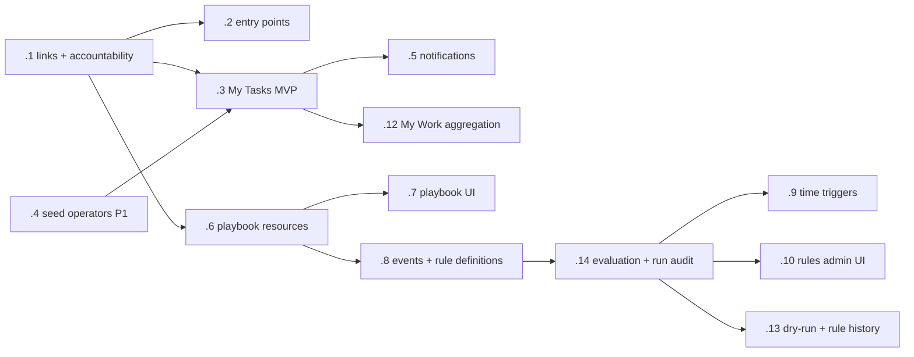

# Task System — Unified Work Management Plan

Status: planned (Phase 1 next). Beadwork epic: `gnome_ga-h6c`.
Revised 2026-07-13 after a second independent research review; revision notes
at the bottom.

## Problem

Garden has two work systems and neither covers day-to-day coordination:

- `Operations.Task` — the office/CRM to-do atom (status machine, priority,
  due_at, polymorphic origin, owner team member) with a full LiveView UI, but
  no links into Execution or Procurement, no unified per-person inbox, no
  templates, and no automation.
- `Execution.Project / WorkItem / WorkOrder / Assignment` — delivery-side scope
  (WBS tree), dispatch, and scheduled billable time.

Patrick and Sam need one place to see "what is on my plate today" across
leads, procurement, finance, builds, and plain todos — and later, tasks that
create themselves from criteria triggers.

## Product model — keep the concepts separate

| Concept        | Meaning                                                        |
|----------------|----------------------------------------------------------------|
| Task           | A concrete human commitment: "Sam, review this bid by Tuesday." |
| Project        | A finite outcome or delivery container.                         |
| WorkItem       | Scoped project content: phase, deliverable, milestone, issue.   |
| Assignment     | Reserved/scheduled labor: "Patrick onsite Tuesday 8–12."        |
| Playbook       | A reusable recipe for generating coordinated tasks.             |
| AutomationRule | Criteria describing when Garden should perform actions.         |
| AutomationRun  | Durable audit record of what fired, why, and what happened.     |

This prevents "task" from meaning task, project phase, calendar appointment,
background job, and automation step simultaneously. No schema merge with
Execution: **WorkItem = scope atom, Assignment = time atom, Task = everything
else.** Unification happens at the view layer only, and only after Task-only
views have settled (see Phase 2).

Lead lifecycle stays explicit in the database (`Acquisition.Finding` →
`Commercial.Signal` → `Commercial.Pursuit`; `Procurement.Bid` for source
records). UI may display "Lead" where clearer.

## Core decisions

1. **One accountable owner per task.** Collaborators/watchers come later.
2. **"My Tasks" before "My Work".** The Phase 1 workspace is Task-only;
   heterogeneous aggregation waits until display semantics are settled.
3. **Direct Ash relationships for supported contexts.** `origin_*` stays for
   provenance only — never for filtering, loading, or integrity.
4. **No new generic project abstraction.** Execution.Project is the project.
5. **Snapshot, don't version (yet).** Playbook runs and automation runs copy
   the definition they executed into the run/task records, so later edits
   never rewrite history. Full `PlaybookVersion` / `RuleVersion` tables are
   deferred until multi-editor reality demands them; the audit invariant holds
   either way.
6. **Durable events for automation; PubSub for UI refresh only.** Automation
   fires from persisted `AutomationEvent` rows processed by Oban — a restart
   can never lose business work.

## Phase 1 — Task assignment foundation

Answers one question exceptionally well: *what does Patrick or Sam need to do
next, by when, and for which Garden record?*

1. **Context links** (`gnome_ga-h6c.1`): `belongs_to` from Task to
   Execution.Project, WorkItem, WorkOrder, Procurement.Bid, and
   ProcurementSource, with postgres references, matching reverse
   `has_many :tasks` on each linked resource, and `by_*` read actions +
   domain interfaces. A task may carry several context links at once (bid +
   organization); `origin_*` stays provenance-only. (Task→Assignment link
   deferred — rare need, cheap to add later.)
2. **Accountability** (same bead, same migration): `created_by_team_member`
   and `assigned_by_team_member` are stamped server-side from the acting
   operator via an Ash change — never accepted as client input. Nil owner
   remains the valid unassigned/triage state (a dedicated triage list ships
   with the UI that needs it); validate assignee is an active TeamMember;
   allow `pending → completed` directly so quick tasks don't require a
   ceremonial start. Owner-specific PubSub topic
   (`task:owner:<team_member_id>`); reassignment publishes to old AND new
   owner.
3. **Operator seeding** (`.4`, P1): idempotent Ash action ensuring active
   TeamMember records for Patrick and Sam linked to their users — never
   inventing credentials; missing users go through the real registration
   flow. (Local dev DB currently has only Dev Admin.)
4. **Entry points** (`.2`): finding, signal, pursuit, organization, person,
   and agent-run pages already have the shared related-tasks panel. This bead
   adds ONLY the missing pages — bid, procurement source, project, work item,
   work order — by reusing that shared panel, prefilled with context link +
   origin provenance.
5. **My Tasks workspace** (`.3`, Task-only): lanes for Overdue / Today /
   Upcoming / Blocked / Unscheduled / Recently completed; every task shows its
   context with a direct return link; admin-only assignee switcher; the whole
   shape exposed through one intent-named domain interface (AGENTS.md
   workspace rule); PubSub-refreshed; mobile-first.

**Acceptance test**: Patrick opens a bid, creates "Sam: verify insurance
requirements," assigns Sam, sets Friday due. It immediately appears in Sam's
My Tasks with a link back to the bid. Sam completes it from mobile; Patrick's
screen refreshes via Ash PubSub.

## Phase 2 — Visibility and notifications

- Sidebar counts + persistent assignment notifications (`.5`).
- Heterogeneous "My Work" aggregation (`.12`): decide how WorkItems and
  Assignments appear alongside Tasks without duplicating linked tasks; saved
  views and filters; reassignment/activity history. Note: Execution resources
  currently publish no Ash PubSub events — adding `pub_sub` blocks to WorkItem
  and Assignment is part of this bead, and the combined workspace is exposed
  through one intent-named domain interface.

## Phase 3 — Repeatable playbooks

- Resources (`.6`): `Playbook` → ordered `PlaybookStep`s (task template
  fields, relative due offset, assignee strategy, ordering, optional
  prerequisite step, inclusion conditions) → `PlaybookRun`.
- Generated tasks retain links to run and originating step, and snapshot the
  step definition at apply time (decision 5).
- Apply/manage UI (`.7`). Playbook content is DB data, never hard-coded.
- Starter playbooks: new bid review, pursuit qualification, proposal prep,
  project kickoff, source remediation, customer onboarding.

## Phase 4 — Record-event automation

Durable pipeline, split into foundation (`.8`) and execution (`.14`):

```
record action commits → AutomationEvent (persisted, post-commit)   [.8]
  → Oban worker evaluates published rules → AutomationRun created  [.14]
  → typed actions executed through Ash interfaces → results on run [.14]
```

- `.8` foundation: AutomationEvent capture via after-transaction hook (never
  mid-transaction), plus `AutomationRule` schema — trigger (resource + event),
  typed field/op/value criteria (JSONB) validated at write time, ordered typed
  actions (create task, apply playbook, assign, update record via intent-named
  action, notify, schedule later evaluation), and a lifecycle:
  **draft → published (immutable in place) → disabled**, clone-to-edit.
- `.14` execution: Oban worker, AutomationRun with per-action results,
  idempotency key per rule+event+action, recursion-depth cap, rule snapshot on
  each run, Oban-backed retries with failure detail, actor/authorization
  context. No arbitrary Elixir/Lua through the admin UI.
- Dry-run/test mode and rule change history (`.13`).
- Admin UI (`.10`): draft/validate/test/publish/clone lifecycle, run history,
  retry of eligible failed actions — no free-form editing of published rules.

## Phase 5 — Time-based rules

Route scheduled and relative-date triggers through AshOban into the same rule
evaluator (`.9`): bid deadline − 7 days; task overdue + 1 day; pursuit
untouched 5 business days; credential nearing expiry; weekly digest. All
criteria/thresholds/assignments are database records.

## Phase 6 — Operational control (backlog, `.11`)

Task dependencies with readiness semantics, WIP limits, aging, cycle
time/throughput, capacity by team member, escalation policies, rule
performance dashboards. Deliberately deferred until real usage exists.

## Sequencing



## Conventions

- All state changes through Ash actions; every new resource gets a domain
  code interface and `pub_sub` block (AGENTS.md rules apply throughout).
- Operational data (playbook contents, rule criteria, thresholds) lives in
  the database, never in module attributes or config.
- Emerald/Tailwind Plus form patterns per CLAUDE.md for all new UI.

## Revision notes (2026-07-13, third review)

Verified against code: `.2` was partially stale (six record pages already have
the shared related-tasks panel — narrowed to the five missing pages);
Execution resources have no `pub_sub` blocks (moved into `.12`); Task topics
are generic (owner-specific topics added to `.1`, consumed in `.5`). Adopted:
reverse `has_many :tasks`; multi-context links allowed; independent acceptance
checks (bid-linked vs project-linked); no invented credentials in seeding;
admin-only assignee switcher; single-domain-interface workspace rule; `.8`
split into foundation (`.8`) + execution (`.14`); rule lifecycle
draft → published-immutable → clone-to-edit; AshOban explicitly for time
triggers with starter rules installed as editable DB records via idempotent
action. Held: snapshot-on-run instead of PlaybookVersion/RuleVersion tables
(immutability + clone gives the same safety); inline step fields over a
reusable TaskTemplate resource until real duplication appears.

## Revision notes (2026-07-13, second review)

Adopted: operator seeding to P1; Task-only My Tasks split from My Work;
accountability fields; pending→completed; durable AutomationEvent/Run with
Oban execution, idempotency, recursion guards; explicit PlaybookStep;
acceptance test. Right-sized: full PlaybookVersion/RuleVersion tables replaced
with snapshot-on-run semantics (same audit invariant, fewer resources);
Task→Assignment link deferred.
